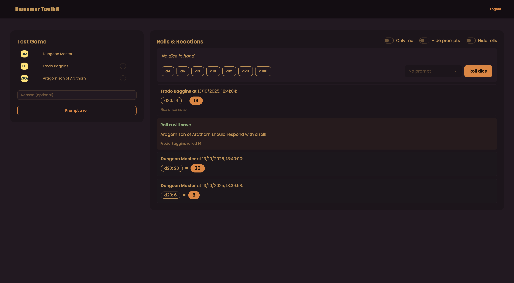
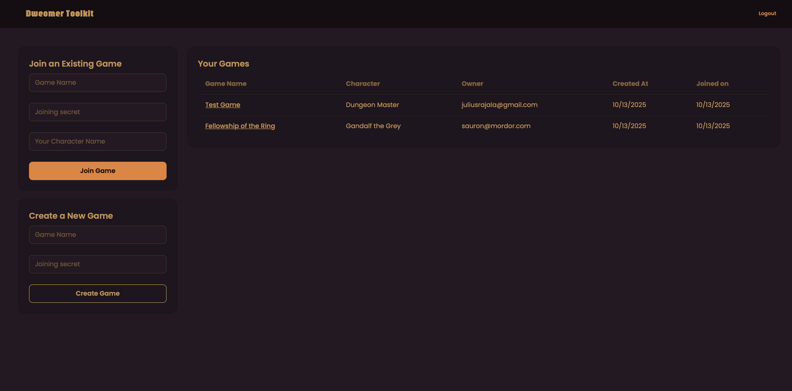

# Dvergmal Roleplaying Toolkit

Provides a pretty simple dice-roller + prompter toolkit for remote roleplaying. You can run this locally or hosted somewhere.

[](https://opensource.org/licenses/MIT)

## Screenshots

<table>
  <tr>
    <td width="45%">
      
      <p align="center"><em>Dice Rolling Interface</em></p>
    </td>
    <td width="45%">
      
      <p align="center"><em>Game Menu</em></p>
    </td>
  </tr>
</table>

## Setup

### Option 1: Using Bun (Local Development)

1. Install dependencies:
```sh
bun install
```

2. Set up your environment variables:
```sh
cp .env.example .env
# Edit .env with your secret values
```

3. Set up seed data (optional, for initial users and games):
```sh
cp db/seed_data.example.json db/seed_data.json
# Edit db/seed_data.json to add your initial users and games
```

The seed data format:
- `users`: Array of users with `email` and `password`
- `games`: Array of games with `name`, `secret` (invitation code), `ownerEmail`, and `joinAll` (boolean to auto-join all users)

4. Start the development server:
```sh
bun dev
```

### Option 2: Using Docker

1. Build and run with Docker:
```sh
docker build -t dvergmal-toolkit .
docker run -p 4321:4321 \
  -e DB_PEPPER="your-secret-pepper" \
  -e INVITATION_CODE="your-invite-code" \
  dvergmal-toolkit
```

2. Or use Docker Compose:
```sh
# Copy and edit environment variables
cp .env.docker .env.docker.local
# Edit .env.docker.local with your values

# Build and run
docker-compose --env-file .env.docker.local up -d
```

The application will be available at `http://localhost:4321`

## License

This project is licensed under the MIT License - see the [LICENSE](LICENSE) file for details.

You are free to use, modify, and distribute this software for any purpose, including commercial use, as long as you include the original copyright notice and license.
